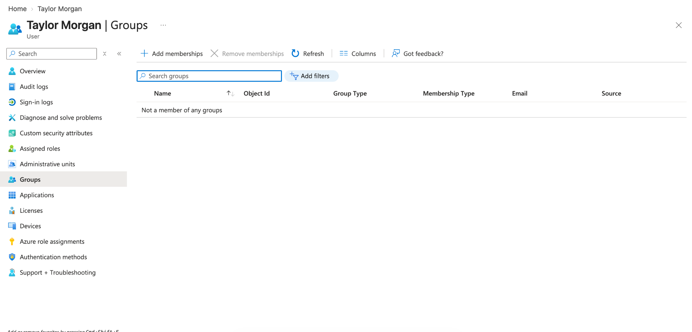
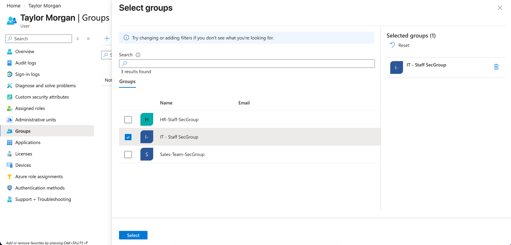
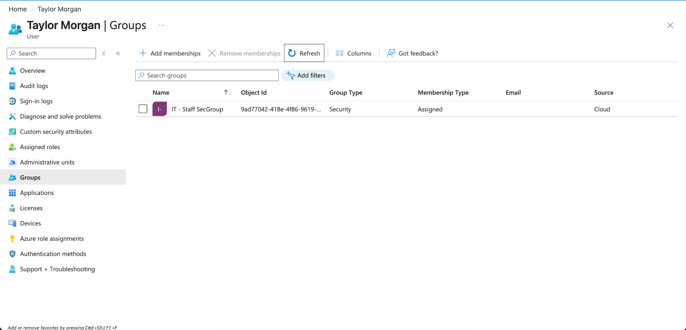

# Microsoft Entra ID Group Assignment

## Objective

Assign a user to a Microsoft Entra ID security group and verify the membership.

## Step 1: Review Existing Group Memberships

Reviewed **Taylor Morgan's** account and confirmed that no group memberships were currently assigned.

## Step 2: Assign the Security Group

Selected **IT - Staff SecGroup** and added Taylor Morgan as a member.

## Step 3: Verify the Group Membership

Confirmed that Taylor Morgan was successfully added to the **IT - Staff SecGroup** security group.

## Skills Demonstrated

- Microsoft Entra ID
- Security Group Management
- User Group Assignment
- Identity and Access Management
- Membership Verification
- Cloud User Administration
